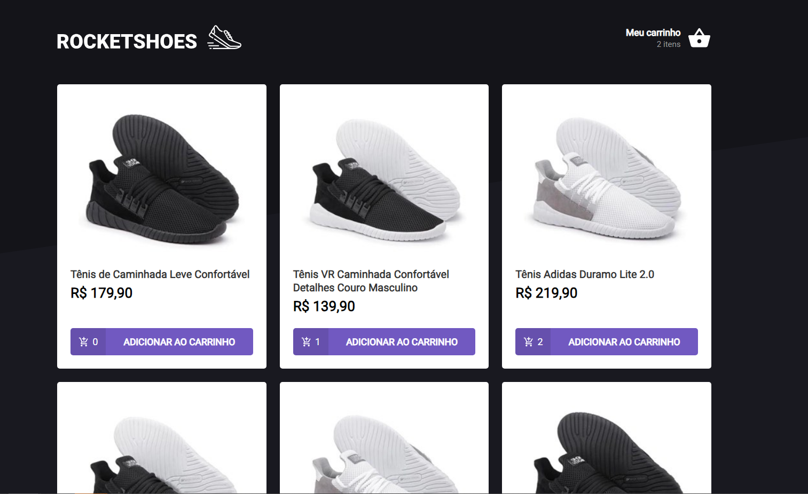
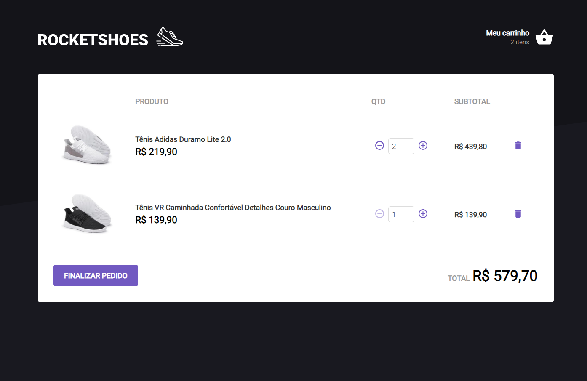

<h1 style="text-align: center; font-weight: bold;">RocketShoes</h1>

## Demo 📸

<div align="center" >
  
  
</div>

---
## About the project

RocketShoes project is a challenge from RocketSeat React Course, which list all products (shoes) from a fake Json-Server and you can add
or remove products from a cart, that is stored in local storage. The application also has verification when the product is out of stock.

### 🛠 Technologies

- React
- React Context Api
- React Router Dom
- Styled Components
- TypeScript
- Axios
- Json Server
---

### 🎲 Run

```bash
# Clone this repository
$ git clone https://github.com/NaathanFerreira/cart-hook.git
# Access the project folder on terminal/cmd
$ cd cart-hook
# Install dependencies
$ yarn
# or
$ npm install
# Start the application
$ yarn start
# or
$ npm start
```